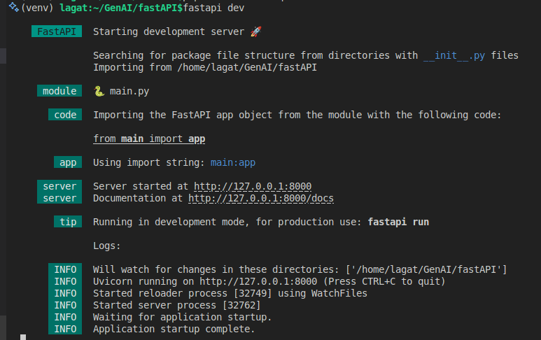
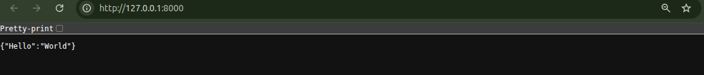
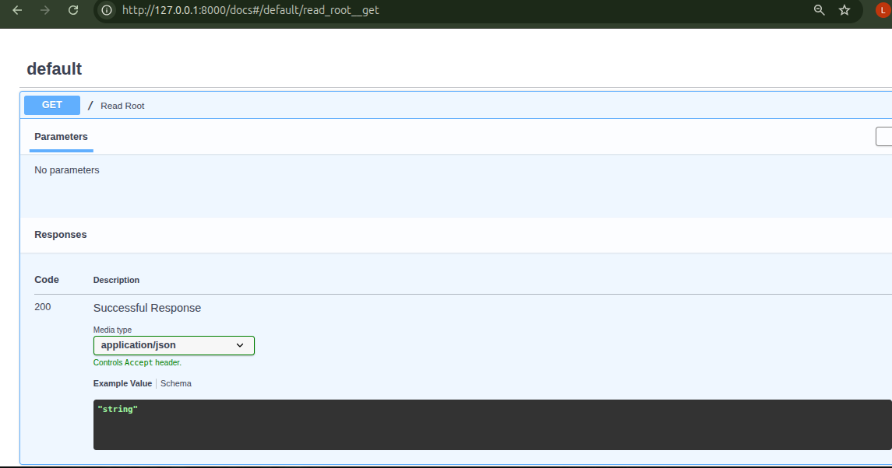

# Prompt-Powered Kickstart: Building a Beginner’s Toolkit for FASTAPI
 
<em>Built this to learn FastAPI. Stayed because it’s dangerously efficient.</em>

## TL;DR
 FastAPI – a modern, high-performance Python web framework for building RESTful APIs.

✨ Why Did I Choose FastAPI Framework?
- Has automatic documentation (Swagger UI) built-in
- Offers performance comparable to Node.js and Go
- Uses standard Python type hints for validation and serialization
- Has excellent async support for handling concurrent requests

🧠 What You’ll Learn
- FastAPI fundamentals (routes, models, validation)
- REST API design principles
- How to test APIs using interactive docs

----------

## Quick Summary of FastAPI

What is FastAPI? 
- FastAPI is a modern, high-performance Python web framework for building RESTful APIs. It combines the best of Flask (simplicity) and Django (batteries-included) with automatic data validation, documentation, and async support.

Where is it Used?
- Building microservices
- Machine learning model serving
- Real-time applications
- REST APIs for web and mobile apps

<strong>Real-World Example:</strong> Netflix uses FastAPI for their recommendation API - it's that scalable!

--------
## System Requirements

| Requirement      | Details                          |
|------------------|----------------------------------|
| OS               | Windows / macOS / Linux          |
| Python Version   | ≥ 3.8                            |
| Editor           | VS Code / PyCharm                |
| Terminal         | Command Prompt / Terminal        |
| Package Manager  | pip                              |


## Installation & Setup Instructions

Tools to Install:
- Python 3.10+ ([Download here](https://www.python.org/downloads/))
- VS Code (optional)

Check Python Installation
Open your terminal and run:

- Check Python version
```bash 
python --version
```
- Or on some systems
```bash
python3 --version
```
Expected output:

```bash
Python 3.11.4
```

```bash
# Clone repo
git clone <your-repo-url>
cd FASTAPI

# Create virtual environment
python3 -m venv venv
source venv/bin/activate  # Mac/Linux
venv\Scripts\activate     # Windows

# Install FastAPI
pip install fastapi[standard]

# Install dependencies
pip install -r requirements.txt

-------
## Minimal Working Example


📂 Project Structure

```bash
fastapi-beginner/
├── main.py
├── models.py
├── routes/
└── requirements.txt
```


The Code (main.py)
```bash
# Import FastAPI class from the fastapi module
# FastAPI is the framework we use to build APIs
from fastapi import FastAPI

# Create an instance of the FastAPI application
# This 'app' object is what runs our API
app = FastAPI()

# -----------------------------
# 1. Root Endpoint ("/")
# -----------------------------

# @app.get("/") means:
# - This function will run when a client sends a GET request
# - The URL path is "/"
@app.get("/")
def read_root():
    # This function returns a Python dictionary
    # FastAPI automatically converts it to JSON
    return {"Hello": "World"}


# -----------------------------
# 2. Path + Query Parameters
# -----------------------------

# {item_id} is a PATH PARAMETER
# → It is part of the URL itself (e.g., /items/5)

# q is a QUERY PARAMETER
# → It is optional and comes after ? in the URL (e.g., ?q=search)

@app.get("/items/{item_id}")
def read_item(item_id: int, q: str | None = None):
    # item_id: int  → FastAPI converts the URL string to an integer automatically
    #                  if someone visits /items/abc, FastAPI rejects it before this runs
    #
    # q: str | None = None  → q is an optional query parameter
    #                          Example: /items/42?q=hello  sets q = "hello"
    #                          Example: /items/42          sets q = None
    # Return both values as a JSON response
    return {
        "item_id": item_id,
        "q": q}
```

requirements.txt

```bash
fastapi>=0.100.0
uvicorn[standard]>=0.22.0
pydantic>=2.0.0
```

How to Run the Application

``` bash
# Run server
fastapi dev
```

Expected Output:



🔌 API Endpoints

| Method | Endpoint        | Description         |
|--------|----------------|----------------------|
| GET    | /              | Welcome message      |
| POST   | /items         | Create item          |
| GET    | /items/{id}    | Get item by ID       |

Test the API:

GET http://127.0.0.1:8000/ → Returns welcome message



POST http://127.0.0.1:8000/items → Create an item




----------

## ⚠️ Common Issues

- Module not found → Activate virtual environment
- Port in use → Change port: `--port 8001`
- Validation error → Check request body matches model

----------------
## Quick Recap

📚 What We Learned

| Topic            | Key Points                                      |
|------------------|-------------------------------------------------|
| FastAPI Basics   | Create app, define routes with decorators       |
| HTTP Methods     | GET, POST, PUT, DELETE                          |
| Data Validation  | Pydantic models for type safety                 |
| Auto Docs        | `/docs` and `/redoc` for testing                |
| Running Server   | `uvicorn main:app --reload`                     |

------------------
## 🚀 Next Steps

- Add authentication (JWT)
- Connect PostgreSQL
- Dockerize the app
- Deploy to Render or AWS

Happy Coding! 🎉
Built with FastAPI + AI Assistance
